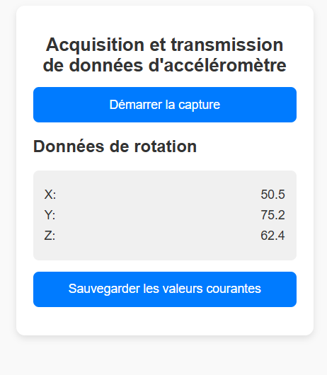
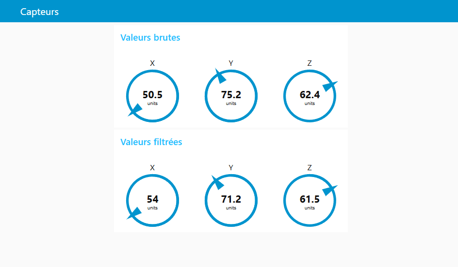
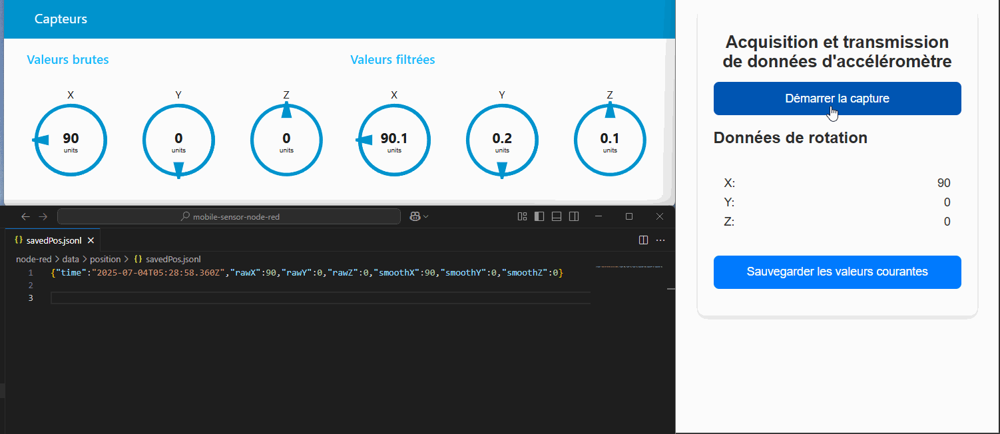

# Acquisition et transmission de données d'accéléromètre
Projet de transmission et visualisation de données d'accéléromètre provenant d'un appareil mobile via une webapp, avec traitement en temps réel dans Node-RED.


> Ce projet est réalisé dans le cadre du **cours de Projet d'intégration** (INF 4018 - TÉLUQ).

## Contexte
Ce projet vise à concevoir un système léger et interactif qui permet de :

- Lire les données des capteurs de mouvement d’un téléphone mobile (accéléromètre via l’API DeviceOrientation).
- Transmettre ces données à un serveur local (Node-RED) par **WebSocket sécurisé (WSS)**.
- Traiter, afficher et sauvegarder les données captées.

---

## Arborescence du projet

```
/
├── public/ # WebApp (HTML/CSS/JS)
│ ├── index.html
│ ├── script.js
│ └── style.css
├── node-red/data # Configuration et stockage Node-RED
│ └── data/position # Données sauvegardées (.jsonl)
├── cert/ # Certificats SSL (non tracké par Git)
│ ├── cert.pem
│ └── key.pem
├── docker-compose.yml # Déploiement de Node-RED
├── images/ # png et gif pour le README
└── README.md
```

---

## Prérequis

- [Node.js](https://nodejs.org/)
- [Docker Desktop](https://www.docker.com/products/docker-desktop/)
- [mkcert](https://github.com/FiloSottile/mkcert) (pour certificat SSL local)
- Navigateur mobile compatible capteurs (Chrome recommandé)
- Un téléphone connecté au même réseau local que votre ordinateur

---

## Installation & Lancement

### 1. Générer les certificats HTTPS

```bash
mkcert -install
mkcert 192.168.0.15  # Remplacez par l’IP locale de votre PC
```
Placez les fichiers générés dans le dossier `cert/`.

### 2. Lancer la WebApp localement

```bash
npm install -g http-server
http-server public -S -C cert/cert.pem -K cert/key.pem -p 8080
```

>Accédez à la webapp via :
>https://<IP locale>:8080 (depuis le téléphone)



### 3. Démarrer Node-RED avec Docker

```bash
docker-compose up -d
```

Une fois Node-RED démarré, ouvrez votre navigateur à l'adresse suivante : `https://localhost:1880/ui`
ou, depuis un appareil sur le même réseau : `https://<IP locale du PC>:1880/ui`



Le dashboard vous permettra de visualiser les valeurs brutes et filtrées en temps réel.

---

## Fonctionnement global

- WebApp
    - Lit les données x, y, z du capteur via DeviceOrientationEvent
    - Transmet les données via WebSocket (wss://)
    - Permet de déclencher une sauvegarde manuelle

- Node-RED
    - Reçoit les données via WebSocket
    - Affiche les valeurs (Dashboard)
    - Filtre les données (ex. moyenne)
    - Sauvegarde une ligne .jsonl sur demande

---

## Sauvegarde des données
- Format : `JSON` par ligne (`.jsonl`)
- Chemin : `node-red/data/position`



---

## Références

- [Node-RED documentation](https://nodered.org/docs/getting-started/windows#running-on-windows)
- [DeviceMotionEvent](https://developer.mozilla.org/en-US/docs/Web/API/DeviceMotionEvent)
- [mkcert Github](https://github.com/FiloSottile/mkcert)
- [Understanding the Device Motion Event API](https://medium.com/@kamresh485/understanding-the-device-motion-event-api-0ce5b3e252f1)
- [Detect the device orientation with JS [tutorial]](https://www.youtube.com/watch?v=fMDuFoqSQfw)
